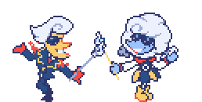
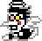

  

  

 

   

 
 

 
 

  
 
 

$${\Huge\color{#493982}\textbf{𝗪𝟐𝗜; ᴄ+ʜ+ɪ 𝗘𝗡𝗖; 𝗗𝗡𝗖}}{\Huge\color{#202b33}\textbf{⁽ᵖˡᵉᵃˢᵉ ᵒʳ ⁱ'ˡˡ ᶜʳʸ⁾}}$$

${\normalsize\color{#b970c4}\textbf{❝}}{\normalsize\color{#777eab}\textbf{𝒪𝒽, 𝐼𝒻 𝒪𝓃𝓁𝓎 𝒴𝑜𝓊 𝒲𝑒𝓇𝑒 }}{\normalsize\color{#c43777}\textbf{𝓜𝓲𝓷𝓮.}}{\normalsize\color{#b970c4}\textbf{❞}}$

${\normalsize\color{#b970c4}\textbf{⮑}}$ <a href="https://github.com/javoks">❤︎‬</a>‬ ${\normalsize\color{#b970c4}\textbf{⮐}}$

 

${\Huge\color{#9dd98f}\textbf{──}}{\Huge\color{#83bbb0}\textbf{──}}{\Huge\color{#9dd98f}\textbf{────}}{\Large\color{#fcdf03}\textbf{ 𝓡𝓲𝓷𝓰 }}{\Huge\color{#83bbb0}\textbf{ ☎ }}{\Large\color{#ff9eca}\textbf{ 𝓡𝓲𝓷𝓰 }}{\Huge\color{#9dd98f}\textbf{────}}{\Huge\color{#83bbb0}\textbf{──}}{\Huge\color{#9dd98f}\textbf{──}}$

 

$${\Huge\color{#63beb8}\textbf{ᛝ}}{\Huge\color{#c92257}\textbf{𝗣𝗼𝗻𝘆 𝗧𝗼𝘄𝗻/𝗚𝗲𝗻𝗲𝗿𝗮𝗹 𝗕𝗬𝗜!}}{\Huge\color{#E3FDC0}\textbf{ᛝ}}$$

$${\Large\color{#c92257}\textbf{}}$$

#### 📌 If you wanna talk with me it's better to whisper, especially when it's stated offtab in my nickname. Late responses can happen.

#### 📌 It can be difficult to start a convo with me since I'm always afk/offtab, buuuut I'm still very social and nice person, trust me!

#### 📌 C+H(+INT) encouraged a lot, even if I'm already sitting with someone, Idm anyone around me while I'm afk! Otherwise, I will state DNI in my nickname.

⁉️ I'm still kinda new to all labeling/system/fictkin and etc stuff, I'm really sorry if I'm gonna make mistakes/mispronoun you because of that!! :(

$${\Huge\color{#c92257}\textbf{}}$$

$${\Huge\color{#63beb8}\textbf{ᛝ}}{\Huge\color{#c92257}\textbf{𝗦𝗼𝗺𝗲 𝗜𝗻𝗳𝗼 𝗔𝗯𝗼𝘂𝘁 𝗠𝗲!}}{\Huge\color{#E3FDC0}\textbf{ᛝ}}$$

$${\Large\color{#c92257}\textbf{}}$$

#### 📍 Usually I dwell in UTDR zone/next to the bakery, but also I can be anywhere else. Even in your walls.

#### 📌 I don't have a SPECIFIC DNI, so just behave appropriately, I will find a common language if I'm interested enough.

❤️ I do respect other people's boundaries, so it's better if you point out what makes you uncomfortable right away!

❤️ Tonetags not needed but appreciated! Will I use them or not - depends on your choice.

⁉️ My humor isn't for everyone. I can be rude or clingy, but only as a JOKE. Just tell me if it makes you uncomfortable.

⁉️ English is NOT my first language, so expect a lot of typos and bad grammar from me.

⁉️ Kinda bad memory & weird jokes. I'm very messy and chaotic person!

⁉️ I can be very distant and busy sometimes. I'm not ignoring anyone on purpose.

⁉️ Significantly younger or older - I won't give a damn if you're a normal person.

📞 I care for my friends a lot. I will kill for every single of them. MARK MY WORDS!! /hj

📞 Most of fandoms I'm in are stated in sp, but hf ones are: Guts And Blackpowder; Phighting!; Deltarune; Nullscape.

📞 I'm multishipper. And also platonic/familial relationships enjoyer. Basically I like anything that doesn't cross the line!

$${\normalsize\color{#63beb8}\textbf{ᛝ}}{\normalsize\color{#c92257}\textbf{𝓟𝓛𝓔𝓐𝓢𝓔 𝗜𝗡𝗧 𝗜𝗳 𝗬𝗼𝘂'𝗿𝗲...}}{\normalsize\color{#E3FDC0}\textbf{ᛝ}}$$

$${\Large\color{#c92257}\textbf{}}$$

🌹 G&B ocs enthusiast or in G&B fandom in general!

🌹 Ocs enjoyer in any way possible!

🌹 Spamtenna enjoyer or in Deltarune fandom in general!

🌹 Medhammer enjoyer or in Phighting fandom in general!

🌹 Nullscape enjoyer!

🌹 Chaotic person (just like me)!

🌹 Yapper!

 

 
 

$${\Huge\color{#FFFFFF}\textbf{Pony Town's Spamton!}}$$
 
<a href="https://github.com/ponytown-nominations">♡</a>&nbsp;&nbsp;&nbsp;<a href="https://github.com/title-town">♡</a>
 

$${\Large\color{#FFFFFF}\textbf{Num.1 Spamtenna shipper!}}$$
 
<a href="https://github.com/ship-town">♡</a>
 

${\Huge\color{#202b33}\textbf{Thank you!}}$

 

 

 
 

 

 

   

 
 
 

${\normalsize\color{#202b33}\textbf{Gonna remake allat one day}}$

 
  
  

  

 
 
 

---
